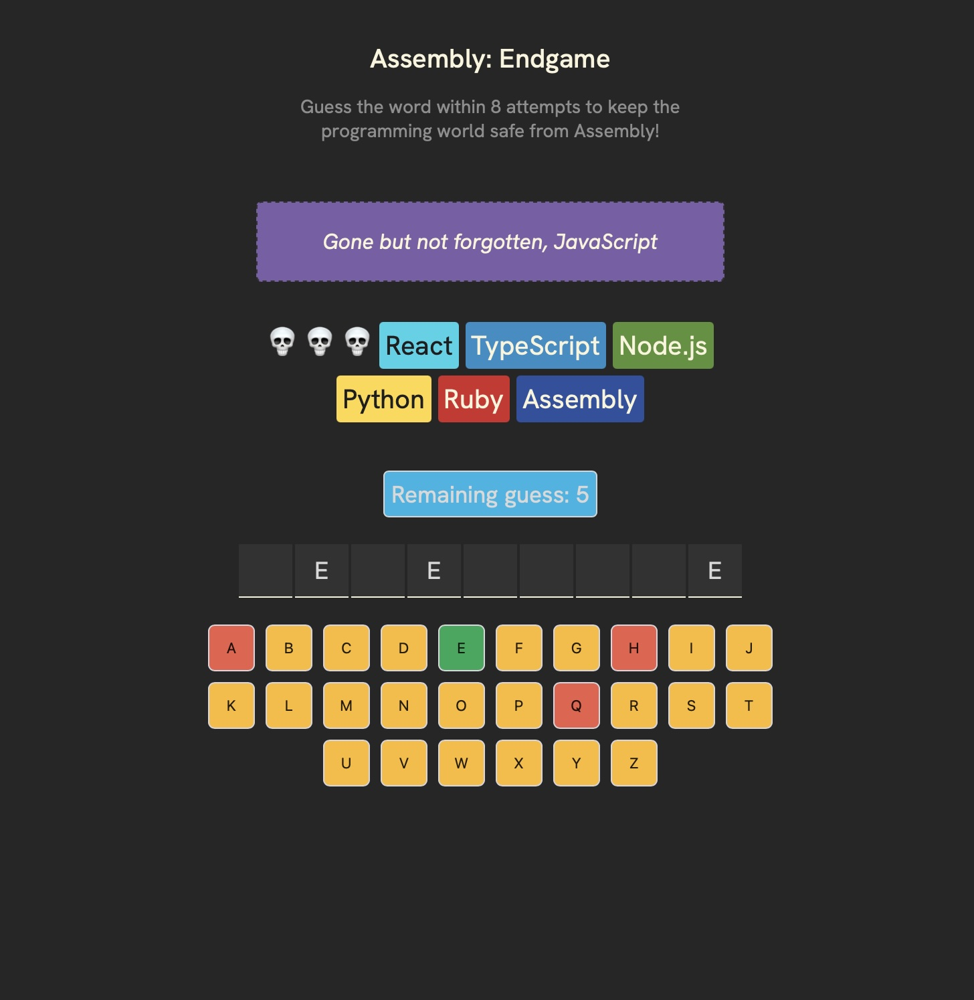

# Assembly Endgame - Programming Language Guessing Game

A fun and educational React-based word guessing game where incorrect guesses make programming languages disappear! Try to guess the word before you're left with Assembly.

  

## 🎮 Game Features

- Interactive keyboard interface
- Progressive difficulty as languages disappear
- Animated confetti celebration on winning
- Farewell messages in different programming languages
- Responsive design
- Accessible UI with ARIA attributes

## 🚀 Technologies Used

- React 19.0
- Vite
- ESLint
- clsx for conditional className handling
- react-confetti for win celebrations
- random-words for word generation

## 🛠️ Installation

1. Clone the repository:

git clone https://github.com/yourusername/assembly-endgame.git

2. Install dependencies:

cd assembly-endgame && npm install

3. Start the development server:

npm run dev

## 🎯 How to Play

1. A random word will be displayed with empty spaces
2. Click letters on the virtual keyboard to make guesses
3. Correct guesses reveal the letter in the word
4. Incorrect guesses make programming languages disappear
5. Win by guessing the word before all modern languages disappear
6. Lose if you're left with only Assembly!

## 🧪 Development

- Built with Vite for fast development and hot module replacement
- ESLint configuration for React best practices
- Component-based architecture
- State management using React hooks

## 📝 License

MIT License - feel free to use and modify for your own projects!

## 🤝 Contributing

1. Fork the repository
2. Create your feature branch (`git checkout -b feature/amazing-feature`)
3. Commit your changes (`git commit -m 'Add amazing feature'`)
4. Push to the branch (`git push origin feature/amazing-feature`)
5. Open a Pull Request

## 🌟 Credits

- Word generation: [random-words](https://www.npmjs.com/package/random-words)
- Confetti effects: [react-confetti](https://www.npmjs.com/package/react-confetti)

## 📬 Contact

- GitHub [ealagoz](https://github.com/ealagoz)
- Project Link: [https://github.com/ealagoz/assembly-endgame](https://github.com/ealagoz/assembly-endgame)
